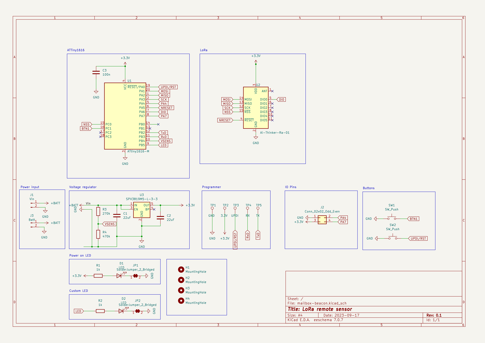
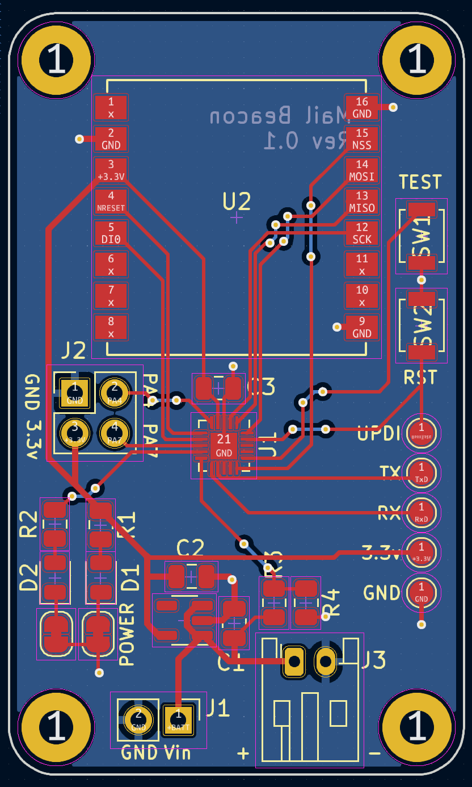
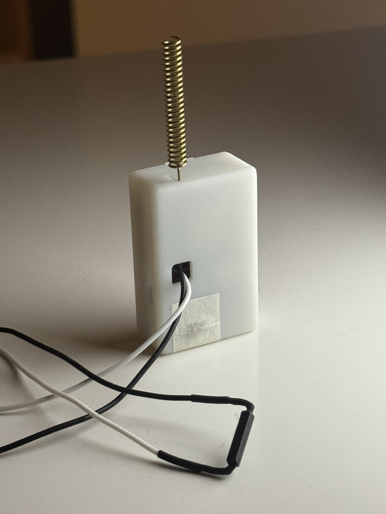

# Mail Beacon

The Mailbox Beacon is a device that detects when a new letter or package has been delivered to your mailbox using a reed switch. It sends a signal to your LoRa gateway, then the gateway sends a message via WiFi to MQTT server. It's designed to integrate with HomeAssistant, but can theoretically work with anything that supports MQTT based sensors.

Specification
--
- Microcontroller: Attiny1616
- Radio module: SX1278 LoRa 433 Mhz (Ai-Thinker-Ra-01)
- Sensor: Reed switch
- Voltage regulator: SPX3819M5-L-3-3
- Programming Protocol: UPDI
- Power consumption: in microamps range when asleep
- Gateway: LILYGO TTGO LoRa32 V2.1
- Status LED

Wiring
--
Reed switch (or any other kind of contact switch) can be connected either to PA4 or PA7 pins. Both pins have interrupts attached and will send a message to the gateway when the value change is detected.

Power LED has a jumper that can be cut to reduce the power consumption.

Battery monitoring
--
The beacon sends the battery voltage (in milivolts) in every LoRa packet, so that you know when you need to re-charge the battery.

Schematic
--

Board
--

Images
--

